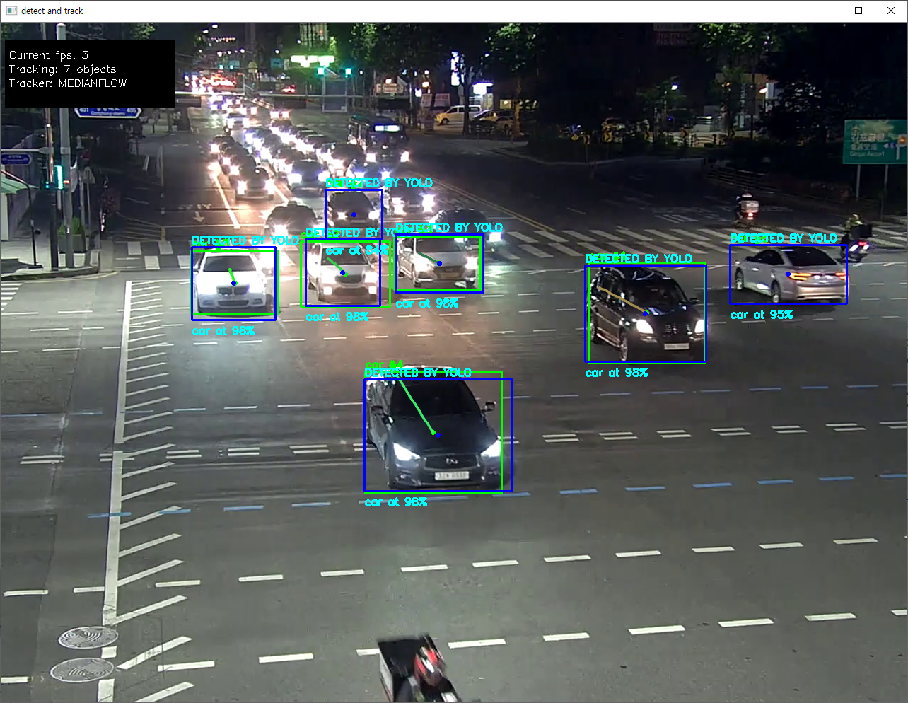
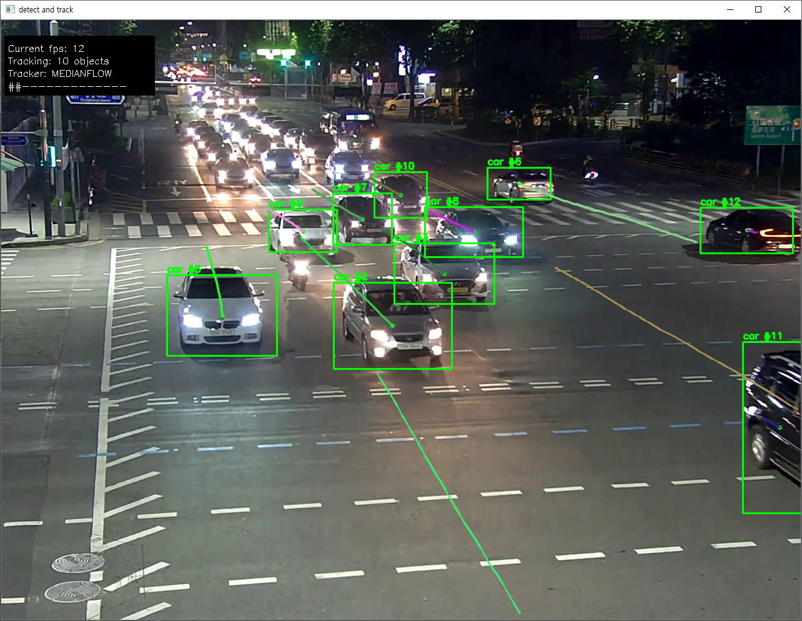

# opencv-tracker
Implementation of OpenCV's built-in trackers and usage. [SlideShare(KOR)](https://www.slideshare.net/KwonkyuPark/opencvs-builtin-trackers)

There are 8 trackers in OpenCV.
- BOOSTING
- MIL
- MOSSE
- CSRT
- TLD
- MEDIANFLOW
- KCF
- GOTURN

In these projects, we'll use these trackers in **python** with opencv-contrib-python.

## benchmark.py
**Required packages**
 - [X] opencv-contrib-python
 - [X] bbox
 - [X] matplotlib 

Benchmarking OpenCV's built-in trackers based on ground-truth. Benchmark ground-truths and
images from [HanYang University](http://cvlab.hanyang.ac.kr/tracker_benchmark/datasets.html)

Tracking results will be drawn on window in realtime. After video ends, accuracy of each tracker's
tracking result and ground-truth will be shown in line graph using matplotlib.

### usage

`benchmark.py [-h] -v VIDEO -g GROUND_TRUTH -t [TRACKER [TRACKER ...]] [--no-status] [--split] [--output]
[--benchmark-output]`

**Mandatory Options**
- -v, --video: Benchmark video file location. Usually it can be generated by images from datasets(check video-generator.py).
  - If you can read and figure out what's going on from benchmark.py, you may want to modify this option
  and logics to use images directly from dataset. In this case, you won't need to generate video from images.
- -g, --ground-truth: Ground-truth data of corresponding video's each frame. It's included in text file.
- -t, --tracker: Trackers to be benchmarked. Multiple trackers can be passed with their names.

**Optional**
- -h, --help: Show usage and arguments information.
- --no-status: Don't show status strings in left above corner of view. Useful when video is small. 
- --split: Draw ground-truth's bounding box and tracker result's bounding box in discrete window.
- --output: Export benchmarking result to video file.
- --benchmark-output: Write each tracker's benchmarking result to text file. 


## MultiTracker.py

**Required packages**
 - [X] opencv-contrib-python

Track multiple objects from single tracker, or track single object from multiple trackers.
Tracking results will be drawn on window in realtime.

### usage

`MultiTracker.py [-h] [-v VIDEO] -t [TRACKER [TRACKER ...]] [--output]`

**Mandatory Options**

- -t, --tracker: Trackers to be used. Multiple trackers can be passed with their names.
  - If you pass multiple trackers then it'll track single object(single-object, multiple-tracker mode).
  - If you pass single tracker then it'll track multiple objects(multiple-object, single-tracker mode).

**Optional**

- -h, --help: Show usage and arguments information.
- -v, --video: The location of video file to use. If video file is not given, it uses webcam feed.
- --output: Export tracking result to video file.

By using OpenCV's selectROI() function, you can set region-of-interest where your object-to-be-tracked
is located. After that, you'll pass the region-of-interest(s) to tracker(s) to start object tracking.

When script starts, you need to press **'s'** to set region-of-interest. If you set region-of-interest
properly, press **'space'** to determine and give this 'object' to tracker(s).
- In single-object, multiple-tracker mode trackers will immediately start tracking that object.
- In multiple-object, single-tracker mode then you can select another object to track or press 'esc' to
stop selecting objects and start tracking with single object.
  - Of course if you select multiple objects, there'll be multiple trackers in memory. But each
  tracker tracks each object and they're all same kind of trackers.
  


## detect_and_track.py
**Required Packages**

- [x] opencv-contrib-python
- [x] bbox

Detect objects using [YOLO](ddie.com/darknet/yolo/) and start tracking. You can't select objects to track in this script. If you want then use *MultiTracker.py*.

You'll need a json file formatted like below.

```json
{
  "yolo-directory": "..\\.\\model\\yolov3\\",
  "yolo-weights": "yolov3.weights",
  "yolo-cfg": "yolov3.cfg",
  "coco-names": "coco.names",
  "yolo-confidence": 0.8,
  "yolo-nms-threshold": 0.3
}
```

- yolo-directory: a **directory** location where yolo files(weights, configuration, coco.names) located.
- yolo-weights: a **filename** which contains weight value. It can be downloaded from [here](https://pjreddie.com/darknet/yolo/)
- yolo-cfg: a **filename** which contains configuration presets. It can be downloaded from [here](https://pjreddie.com/darknet/yolo/)
- coco-names: a **filename** which contains object category list. It can be downloaded from [here](https://github.com/pjreddie/darknet/blob/master/data/coco.names)
- yolo-confidence: a threshold to filter detected objects based on confidence of result. If value is too low the rate of false-positive detection may increase.
- yolo-nms-threshold: a threshold to apply non-maximum-suppression for detection results. YOLO doesn't do NMS on detection results.

### Usage

`usage: detect_and_track.py [-h] [-v VIDEO] -y YOLO_JSON -t TRACKER [--output] [--yolo-threshold YOLO_THRESHOLD] [--manual-skip] [--manual-yolo]`

**Mandatory Options**

- -y, --yolo-json: The location of json file which contains directory, filename, threshold values shown above.
- -t, --tracker: Trackers to be used. Only one tracker can be used at a time.

**Optional**

- -h, --help: Show usage and arguments information.
- -v, --video: The location of video file to use. If video file is not given, it uses webcam feed.
- --output: Export tracking result to video file.
- --yolo-threshold: Set frame threshold to let YOLO detects object every Nth frame. Default is every 15 frames.
- --manual-skip: Option to let user skips each frame manually. Press anything but **'q'** to skip('q' to quit program).
- --manual-yolo: Option to show detection results of YOLO every Nth frame. Press any key to continue.

When program starts, you can select initial frame to detect object and start tracking. Press **anything but 'q'** to skip frame and get new detection results. Press **'q'** to start tracking detected objects.

Every Nth(default 15) frame YOLO detects object and initialize trackers. Each object is tracked by each tracker. I did some tweaks on comparing detection results and existing tracking results so single object won't be tracked by multiple trackers. But it's not perfect so single object can be tracked by multiple trackers.

The very first target of this program is CCTV video file showing vehicles moving on crossroads to detect vehicles and track until they're gone. I didn't test this script on other circumstances so results may vary on given video files characteristics.






